# 航购 HangBuy | 二手物品信息交流平台


## 1    Introduction

With the rapid development of Internet technology, many online trading platforms for second-hand goods have emerged. These platforms vary in size but are not fully applicable to college students due to their high versatility. To compensate for existing platforms' shortcomings, we propose developing an information exchange platform tailored to on-campus students for used goods.

The platform is in great demand. For example, we all witnessed tons of valuable used items being abandoned during the last graduation month. Such goods could be better utilized if a well-functioned platform existed. Besides, some students may post ads in WeChat Moments to sell used goods. If such ads could be posted on a platform, they would be less annoying and more useful to those in need. 

## 2    Frameworks

HangBuy will be a web platform with a separate frontend and a backend. We will use the Python-based Django framework as the backend and the JS-based Vue framework as the frontend. Although Django provides a convenient MVT (Model-View-Template) design pattern to facilitate prototyping in agile development, the separation of the frontend and the backend would allow for better teamwork on the one hand, and reducing the coupling of the system on the other, while adding scalability for further development. In addition, the backend will provide RESTful (REpresentational State Transfer) API, and the frontend will retrieve the API through asynchronous JavaScript, which is also a common technology for modern systems.

## 3    Functions

### 3.1    Goods

The core of the platform is to trade second-hand goods, so users can add, delete and check the information of goods, such as name, category, description, picture, price, and so on. To facilitate the inquiry and exchange of other information about the goods, users can comment on the goods and reply to others' comments. Users can also add, delete, and check the information about the goods they are in need.

### 3.2    Users

Users are those who use the platform. First, it is necessary to provide a login function so that users can log in by user name and password, and have a nickname, avatar, personal profile as well as other information. Users can comment and chat with each other so that they can develop mutual understanding. The chat history will be stored in the system so important information will not be lost. Users can complain about products, and the complaint information can include text and pictures. Finally, the system can trace the complained product to the corresponding user and notify the user by system messages.

### 3.3    Transactions

Since the system is for on-campus students, it does not involve an online transaction function, and all substantial transactions occur offline. When a user buys an item, the system creates an order and notifies the other user in the form of a system message, and users can contact each other through the displayed contact information. After the offline transaction is completed, both users confirm the order, and the order is closed with the corresponding item hidden.

### 3.4    Administrations

The system requires an administrator user to manage the information in the system. If a complaint is received, the administrator can hide the corresponding item or comment and notify the corresponding user through a system message. All hidden operations of the administrator are to be logged. The administrator can also view the statistical information in the background and export the Excel sheet. The system also provides a feedback function where users can submit bugs or improvements to the system for the administrator to view.

### 3.5    Securities

Your privacy is our priority. The system will never store the plaintext passwords directly, nor does it store only the password hashes, but rather the hashes with random “salt” iterated over many times. This ensures that even if the database is compromised and the hash of common weak passwords is obtained, it is impossible to look up the table to acquire common weak passwords. In addition, we require that the user’s password must meet some user-defined integrity. Besides, in a production environment, the credentials such as username and password needed for the backend to connect to the database will not be written explicitly in the code, but are read from the operating system environment variables. We will set strong passwords for the operating system.

In addition, the backend will check all the data received. Therefore, the backend will have special consideration for logical security. For example, all sessions of a user except the current one should be logged out at the backend after they change their passwords; primary keys should not use data with actual meaning; logged-in users can only delete and change items they have posted; logged-in users cannot log in repeatedly under the same session; users can only buy goods that have not been sold; users can only complete orders they have placed; original images should be deleted after the pictures are updated; oversized request contents should be rejected; etc.

The rest of the document is in Chinese.

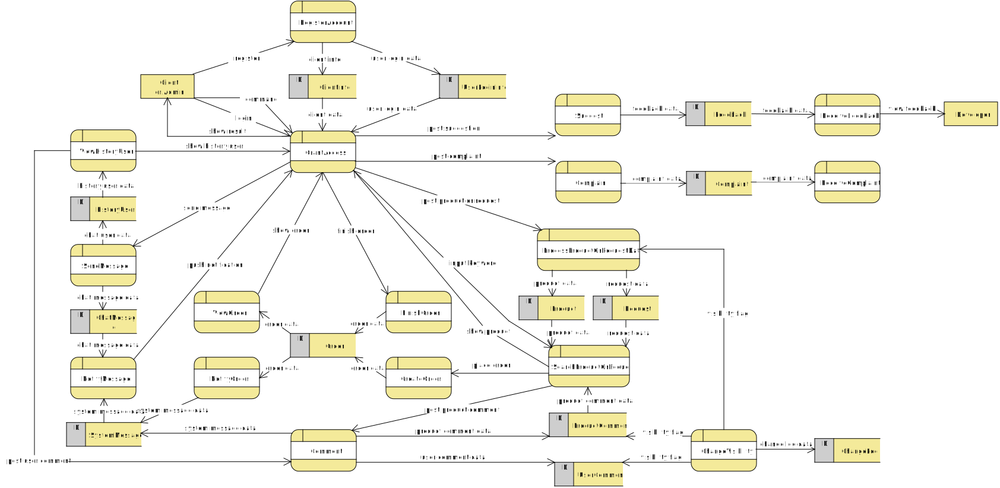

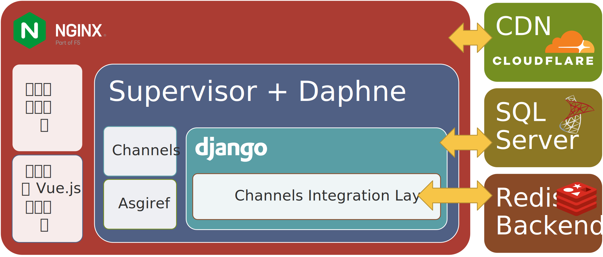

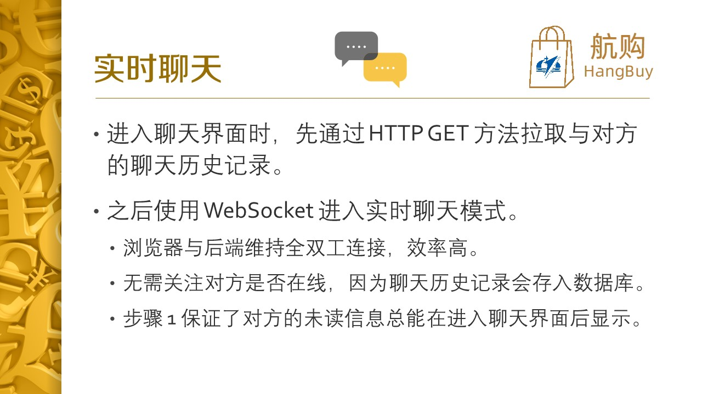

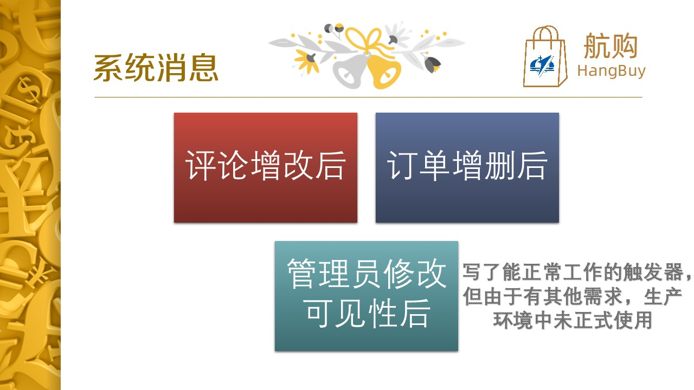

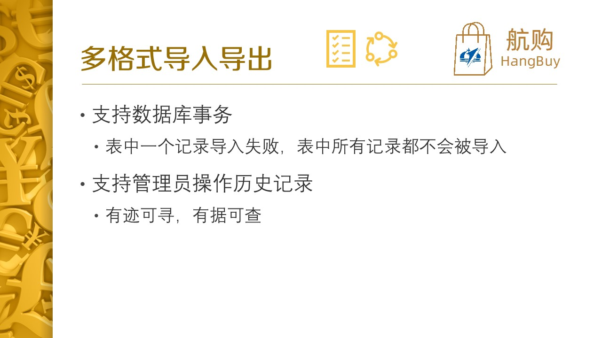

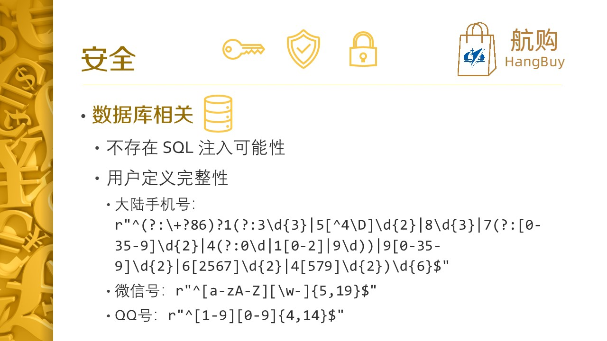

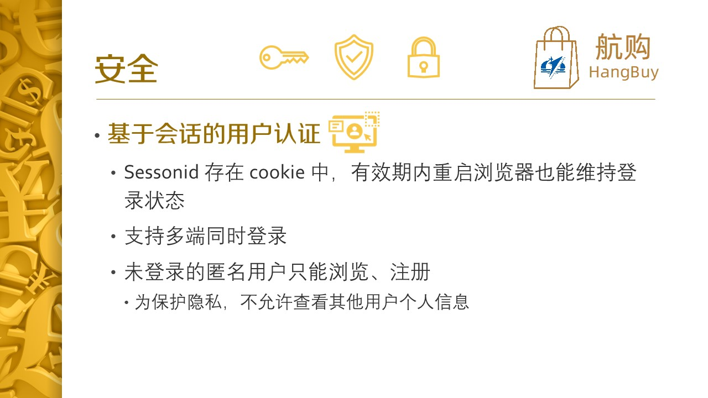

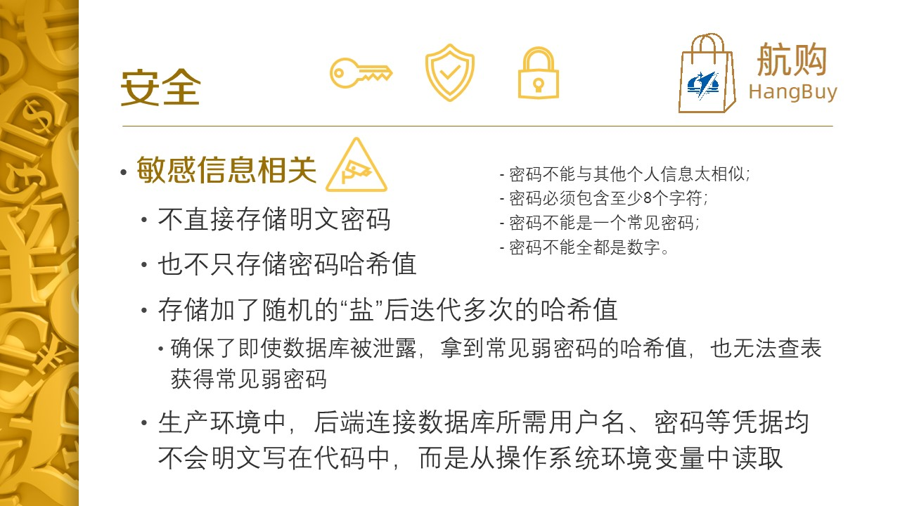

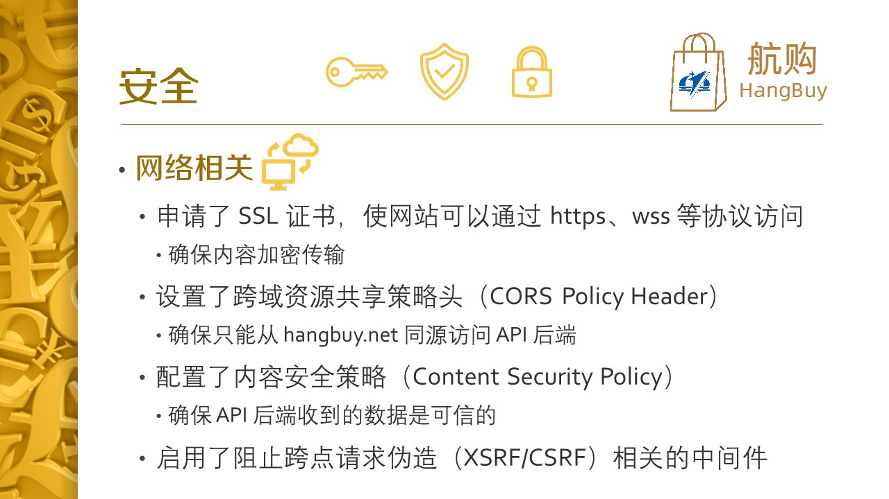

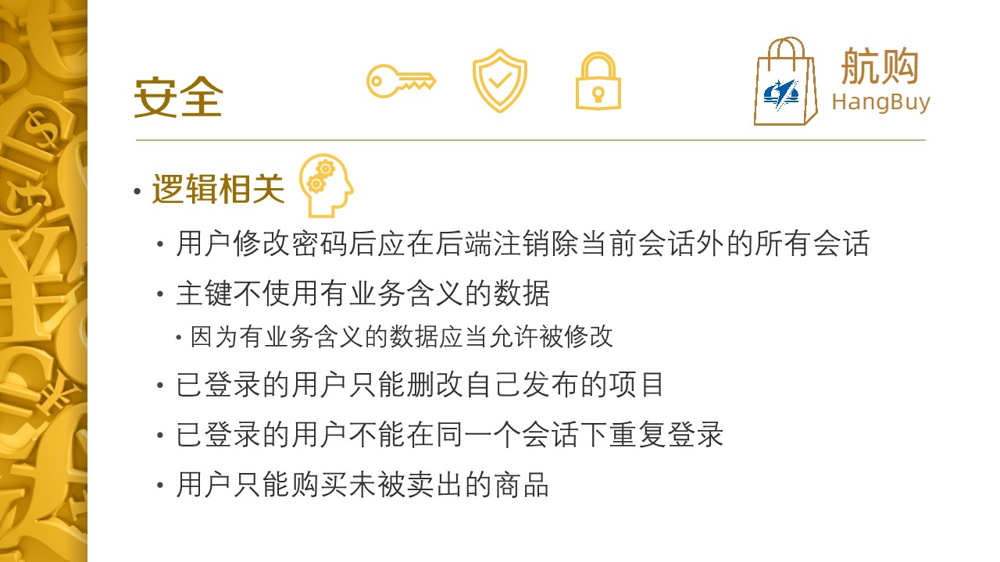

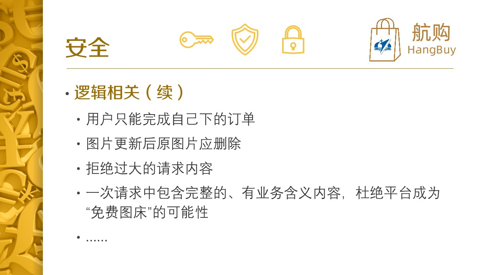

本文档中的 API 不是最新版。

## 准备工作

含敏感信息，提交文档已略去。

## 修改后的数据表

- 商品（商品id，商品名，发布时间，商品类别，商品描述，商品图片，商品价格，商品卖方id，是否显示）
- 求购信息（求购信息id，求购品名，求购时间，求购品类别，求购品描述，期望价格，求购方id，是否显示）
- 商品评论（评论id，评论商品id，评论者id，回复评论id，评论时间，评论内容，是否显示）
- 求购品评论（评论id，评论求购品id，评论者id，回复评论id，评论时间，评论内容，是否显示）
- 用户（用户id，用户类别，用户名，用户密码哈希值，用户密码盐）
  - 注：使用了 Django 内置的`User`，与此稍有不同。
- 客户信息（用户id，昵称，头像，手机号，邮箱，微信号，QQ号，个人简介）
- 客户评论（评论id，评论客户id，评论者id，回复评论id，评论时间，评论内容，是否显示）
- 商品订单（订单id，买方id，商品id，下单时间，成交时间）
- 求购品订单（订单id，卖方id，求购品id，下单时间，成交时间）
- 聊天信息（信息id，用户id1，用户id2，时间，内容）
- 系统消息（消息id，用户id，时间，消息类别，消息内容）
- 管理员操作记录（记录id，用户id，投诉时间，操作类型，对应id）
  - 注：Django 内置的`admin`会记录管理员的操作。
- 商品投诉信息（信息id，投诉者id，投诉时间，被投诉商品id，投诉文字，投诉图片）
- 求购投诉信息（信息id，投诉者id，投诉时间，被投诉求购id，投诉文字）
- 系统反馈（反馈id，用户id，反馈时间，反馈类型，反馈文字，反馈图片）

## 功能及 API

务必注意数据类型与格式！提交错误格式的数据可能有 3 种结果：

1. HTTP 状态码 `400` 或 `403`，返回`json`，`detail`为报错信息。
2. HTTP 状态码 `400` 或 `404`，返回`json`，`detail`有错误的字段，内容为报错信息。
3. HTTP 状态码 `500`。请及时报告。
4. WebSocket `closeEvent.code == 4003` 或 `4004`，分别对应未登录和用户不存在。（由于后端库没有设置 `closeEvent.reason` 的 API，因此不要尝试直接显示 `closeEvent.reason`，否则只能得到空串）

注意状态码可能不仅限于以上情况。

对于`axios`异步获取的对象`e`，可通过`e.status`获得状态码，`e.data`获得`json`解析后的对象。

注册密码不合规时，错误字段是报错消息的列表，样例如下：

```json
{
    "detail": {
        "password": [
            "密码长度太短。密码必须包含至少 8 个字符。",
            "这个密码太常见了。"
        ]
    }
}
```

如果所请求的内容不存在，比如某商品没有评论，返回`json`，若状态码为 404，`detail`为`未找到。`。但这不是错误，和“无该页面”的含义不一样，处理方式也应该不一样。

目前后端限制所有上传的文件大小不得大于 2.5 MB，超过此大小的文件将不被接收，但未必报错，包括对于管理员。请也在前端加以限制。如果觉得该大小限制不合理，可以调整。

如果发现明显不合理的数据需求，请及时报告。

### 商品

|      | URL                         | Method | Params                                                   | Description                                              | Auth |
| ---- | --------------------------- | ------ | -------------------------------------------------------- | -------------------------------------------------------- | ---- |
| 1    | `product/`                  | GET    | `?category=<int>&search=<str>&pagesize=<int>&page=<int>` | 列出商品，所有参数均可选，`pagesize`和`page`若出现必成对 |      |
| 2    | `product/<int:product_id>/` | GET    |                                                          | 列出所选商品                                             |      |
| 3    | `product/`                  | POST   |                                                          | 发布商品                                                 | √    |
| 4    | `product/<int:product_id>/` | PATCH  |                                                          | 修改商品（无需提供全部信息）                             | √    |
| 5    | `product/<int:product_id>/` | DELETE |                                                          | 删除商品（无需提供信息）                                 | √    |
| 6    | `user/product/`             | GET    |                                                          | 用户商品                                                 | √    |

- 类别从 1 开始，依次是（从淘宝上看的，可改）：

  ```python
  其它 = auto()
  女装男装 = auto()
  鞋类箱包 = auto()
  护肤彩妆 = auto()
  汇吃美食 = auto()
  珠宝配饰 = auto()
  家装建材 = auto()
  家居家纺 = auto()
  百货市场 = auto()
  车类用品 = auto()
  手机数码 = auto()
  家电办公 = auto()
  运动户外 = auto()
  花鸟文娱 = auto()
  农资采购 = auto()
  ```

- Example 1

  ```json
  {
      "detail": [
          {
              "product_id": 2,
              "seller_fullname": "TanKevin",
              "seller_avatar": "/api/media/profile_img/f4274313-16c6-42be-ab47-db90e8772b0c.jpg",
              "name": "test",
              "create_time": "2022-08-07T14:15:51.162988+08:00",
              "category": 1,
              "description": "test",
              "image": "/api/media/product_img/8d167574-9d1c-4c59-b697-b95748d98bfa.jpg",
              "price_currency": "CNY",
              "price": "0.02",
              "sold_out": false,
              "seller": 1
          },
          {
              "product_id": 3,
              "seller_fullname": "TanKevin",
              "seller_avatar": "/api/media/profile_img/f4274313-16c6-42be-ab47-db90e8772b0c.jpg",
              "name": "很棒的商品",
              "create_time": "2022-08-14T13:29:37.339593+08:00",
              "category": 1,
              "description": "很酷的商品",
              "image": "/api/media/product_img/b669c7f4-e717-4236-805d-837ff9c7639f.jpg",
              "price_currency": "CNY",
              "price": "0.01",
              "sold_out": false,
              "seller": 1
          }
      ]
  }
  ```

- Example 2

  ```json
  {
      "detail": {
          "product_id": 2,
          "seller_fullname": "TanKevin",
          "seller_avatar": "/api/media/profile_img/f4274313-16c6-42be-ab47-db90e8772b0c.jpg",
          "name": "test",
          "create_time": "2022-08-07T14:15:51.162988+08:00",
          "category": 1,
          "description": "test",
          "image": "/api/media/product_img/8d167574-9d1c-4c59-b697-b95748d98bfa.jpg",
          "price_currency": "CNY",
          "price": "0.02",
          "sold_out": false,
          "seller": 1
      }
  }
  ```

- Example 3

  ```json
  {
      "name": "test",
      "category": 1,
      "description": "test",
      "image": <图片文件>,
      "price_currency": "CNY",  // 必须有
      "price": "0.02"
  }
  ```

### 求购

|      | URL                       | Method | Params                                                   | Description                                                  | Auth |
| ---- | ------------------------- | ------ | -------------------------------------------------------- | ------------------------------------------------------------ | ---- |
| 1    | `demand/`                 | GET    | `?category=<int>&search=<str>&pagesize=<int>&page=<int>` | 列出求购信息，所有参数均可选，`pagesize`和`page`若出现必成对 |      |
| 2    | `demand/<int:demand_id>/` | GET    |                                                          | 列出所选求购信息                                             |      |
| 3    | `demand/`                 | POST   |                                                          | 发布求购信息                                                 | √    |
| 4    | `demand/`                 | PATCH  |                                                          | 修改求购信息（无需提供全部信息）                             | √    |
| 5    | `demand/`                 | DELETE |                                                          | 删除求购信息（无需提供信息）                                 | √    |
| 6    | `user/demand/`            | GET    |                                                          | 用户求购信息                                                 | √    |

- Example 1

  ```json
  {
      "detail": [
          {
              "demand_id": 1,
              "demander_fullname": "TanKevin",
              "demander_avatar": "/api/media/profile_img/f4274313-16c6-42be-ab47-db90e8772b0c.jpg",
              "name": "test",
              "create_time": "2022-08-07T16:20:12.559933+08:00",
              "category": 1,
              "description": "test",
              "price_currency": "CNY",
              "price": "0.01",
              "is_met": false,
              "demander": 1
          },
          {
              "demand_id": 5,
              "demander_fullname": "TanKevin",
              "demander_avatar": "/api/media/profile_img/f4274313-16c6-42be-ab47-db90e8772b0c.jpg",
              "name": "求购",
              "create_time": "2022-08-07T16:40:06.318226+08:00",
              "category": 1,
              "description": "真的很想买",
              "price_currency": "CNY",
              "price": "0.01",
              "is_met": false,
              "demander": 1
          }
      ]
  }
  ```

- Example 2

  ```json
  {
      "detail": {
          "demand_id": 1,
          "demander_fullname": "TanKevin",
          "demander_avatar": "/api/media/profile_img/f4274313-16c6-42be-ab47-db90e8772b0c.jpg",
          "name": "test",
          "create_time": "2022-08-07T16:20:12.559933+08:00",
          "category": 1,
          "description": "test",
          "price_currency": "CNY",
          "price": "0.01",
          "is_met": false,
          "demander": 1
      }
  }
  ```

- Example 3

  ```json
  {
      "name": "test",
      "category": 1,
      "description": "test",
      "price_currency": "CNY",  // 必须有
      "price": "0.02"
  }
  ```

### 商品评论（需求评论 URL 前缀为`demand/`，用户评论 URL 前缀为`user/profile/`，其它一样，不再单独列出）

|      | URL                                                  | Method | Params                       | Description                                      | Auth |
| ---- | ---------------------------------------------------- | ------ | ---------------------------- | ------------------------------------------------ | ---- |
| 1    | `product/<int:product_id>/comment/`                  | GET    | `?pagesize=<int>&page=<int>` | 列出商品所有评论，`pagesize`和`page`若出现必成对 |      |
| 2    | `product/<int:product_id>/comment/`                  | POST   |                              | 发布评论                                         | √    |
| 3    | `product/<int:product_id>/comment/<int:comment_id>/` | PATCH  |                              | 修改评论                                         | √    |
| 4    | `product/<int:product_id>/comment/<int:comment_id>/` | DELETE |                              | 删除评论（无需提供信息）                         | √    |

- Example 1

  ```json
  {
      "detail": [
          {
              "comment_id": 2,
              "commenter_fullname": "TanKevin",
              "commenter_avatar": "/api/media/profile_img/f4274313-16c6-42be-ab47-db90e8772b0c.jpg",
              "create_time": "2022-08-08T13:51:47.962774+08:00",
              "content": "这个东西好用吗？",
              "product": 2,
              "commenter": 1,
              "review_comment": null
          },
          {
              "comment_id": 3,
              "commenter_fullname": "TanKevin",
              "commenter_avatar": "/api/media/profile_img/f4274313-16c6-42be-ab47-db90e8772b0c.jpg",
              "create_time": "2022-08-14T16:25:49.710908+08:00",
              "content": "这个东西用了多久了？",
              "product": 2,
              "commenter": 1,
              "review_comment": null
          }
      ]
  }
  ```

- Example 2

  ```json
  {
      "content": "很好用！",
      "review_comment": 2
  }
  ```

### 商品订单

|      | URL                                  | Method | Params                       | Description                                      | Auth |
| ---- | ------------------------------------ | ------ | ---------------------------- | ------------------------------------------------ | ---- |
| 1    | `user/product/order/`                | GET    | `?pagesize=<int>&page=<int>` | 列出用户所有订单，`pagesize`和`page`若出现必成对 | √    |
| 2    | `user/product/order/`                | POST   |                              | 商品下单                                         | √    |
| 3    | `user/product/order/<int:order_id>/` | PATCH  |                              | 完成订单（无需提供信息）                         | √    |
| 4    | `user/product/order/<int:order_id>/` | DELETE |                              | 取消或删除订单                                   | √    |

- Example 1

  ```json
  {
      "cnt": 2,
      "detail": [
          {
              "order_id": 3,
              "product": {
                  "product_id": 2,
                  "seller_fullname": "TanKevin",
                  "seller_avatar": null,
                  "name": "test1",
                  "create_time": "2022-08-07T14:15:51.162988+08:00",
                  "category": 1,
                  "description": "test",
                  "image": "/api/media/product_img/8d167574-9d1c-4c59-b697-b95748d98bfa.jpg",
                  "price_currency": "CNY",
                  "price": "0.02",
                  "sold_out": false,
                  "seller": 1
              },
              "create_time": "2022-08-14T16:57:15.343610+08:00",
              "finish_time": "2022-08-14T17:04:34.503467+08:00",
              "buyer": 1
          },
          {
              "order_id": 4,
              "product": {
                  "product_id": 3,
                  "seller_fullname": "TanKevin",
                  "seller_avatar": null,
                  "name": "test2",
                  "create_time": "2022-08-14T13:29:37.339593+08:00",
                  "category": 1,
                  "description": "很酷的商品",
                  "image": "/api/media/product_img/b669c7f4-e717-4236-805d-837ff9c7639f.jpg",
                  "price_currency": "CNY",
                  "price": "0.01",
                  "sold_out": true,
                  "seller": 1
              },
              "create_time": "2022-08-14T16:58:44.088308+08:00",
              "finish_time": "2022-08-15T22:36:52.432172+08:00",
              "buyer": 1
          }
      ]
  }
  ```

- Example 2

  ```json
  {
      "product": 3
  }
  ```

### 求购品订单

|      | URL                                 | Method | Params                       | Description                                            | Auth |
| ---- | ----------------------------------- | ------ | ---------------------------- | ------------------------------------------------------ | ---- |
| 1    | `user/demand/order/`                | GET    | `?pagesize=<int>&page=<int>` | 列出商品所有求购品订单，`pagesize`和`page`若出现必成对 | √    |
| 2    | `user/demand/order/`                | POST   |                              | 求购品下单                                             | √    |
| 3    | `user/demand/order/<int:order_id>/` | PATCH  |                              | 完成订单（无需提供信息）                               | √    |
| 4    | `user/demand/order/<int:order_id>/` | DELETE |                              | 取消或删除订单                                         | √    |

- Example 1

  ```json
  {
      "cnt": 2,
      "detail": [
          {
              "order_id": 2,
              "demand": {
                  "demand_id": 1,
                  "demander_fullname": "TanKevin",
                  "demander_avatar": null,
                  "name": "test",
                  "create_time": "2022-08-07T16:20:12.559933+08:00",
                  "category": 1,
                  "description": "test",
                  "price_currency": "CNY",
                  "price": "0.01",
                  "is_met": false,
                  "demander": 1
              },
              "create_time": "2022-08-14T17:03:08.438894+08:00",
              "finish_time": null,
              "seller": 1
          },
          {
              "order_id": 3,
              "demand": {
                  "demand_id": 5,
                  "demander_fullname": "TanKevin",
                  "demander_avatar": null,
                  "name": "求购",
                  "create_time": "2022-08-07T16:40:06.318226+08:00",
                  "category": 1,
                  "description": "真的很想买",
                  "price_currency": "CNY",
                  "price": "0.01",
                  "is_met": true,
                  "demander": 1
              },
              "create_time": "2022-08-14T17:03:37.334862+08:00",
              "finish_time": "2022-08-14T17:04:15.961198+08:00",
              "seller": 1
          }
      ]
  }
  ```

- Example 2

  ```json
  {
      "demand": 5
  }
  ```

### 系统消息

|      | URL                                     | Method | Params                       | Description                                                  | Auth |
| ---- | --------------------------------------- | ------ | ---------------------------- | ------------------------------------------------------------ | ---- |
| 1    | `user/message/system/`                  | GET    | `?pagesize=<int>&page=<int>` | 列出用户所有系统消息，`pagesize`和`page`若出现必成对，要求未读消息突出显示 | √    |
| 2    | `user/message/system/<int:message_id>/` | PATCH  |                              | 将选定消息设为已读（无需提供信息）                           | √    |
| 3    | `user/message/system/<int:message_id>/` | DELETE |                              | 删除选定消息（无需提供信息）                                 | √    |

- Example 1

  ```json
  {
      "detail": [
          {
              "message_id": 1,
              "create_time": "2022-08-08T20:03:27.464467+08:00",
              "content": "您的商品已卖出，请及时与买方联系。",
              "is_read": true,
              "user": 1
          },
          {
              "message_id": 2,
              "create_time": "2022-08-08T20:30:38.679065+08:00",
              "content": "您的求购品已有卖方愿意提供，请及时与卖方联系。",
              "is_read": false,
              "user": 1
          },
          {
              "message_id": 3,
              "create_time": "2022-08-08T22:07:28.885976+08:00",
              "content": "您有一条新评论。",
              "is_read": false,
              "user": 1
          },
          {
              "message_id": 5,
              "create_time": "2022-08-14T16:43:13.216117+08:00",
              "content": "您的商品有一条新评论。",
              "is_read": false,
              "user": 1
          },
          {
              "message_id": 6,
              "create_time": "2022-08-14T16:43:13.221117+08:00",
              "content": "您的评论有一条新回复。",
              "is_read": false,
              "user": 1
          },
          {
              "message_id": 7,
              "create_time": "2022-08-14T16:44:04.062127+08:00",
              "content": "您的求购品有一条新评论。",
              "is_read": false,
              "user": 1
          },
          {
              "message_id": 8,
              "create_time": "2022-08-14T16:45:29.810843+08:00",
              "content": "您有一条新评论。",
              "is_read": false,
              "user": 1
          },
          {
              "message_id": 9,
              "create_time": "2022-08-14T16:58:44.092140+08:00",
              "content": "您的商品已卖出，请及时与买方联系。",
              "is_read": false,
              "user": 1
          },
          {
              "message_id": 10,
              "create_time": "2022-08-14T17:03:37.338862+08:00",
              "content": "您的求购品已有卖方愿意提供，请及时与卖方联系。",
              "is_read": false,
              "user": 1
          }
      ]
  }
  ```

### 商品投诉

- URL：`product/complain/`

- Method：POST

- Auth: √

- Example：

  ```json
  {
      "product": 2,
      "complaint": "违规",
      "image": <图片文件>
  }
  ```

### 求购品投诉

- URL：`demand/complain/`

- Method：POST

- Auth：√

- Example：

  ```json
  {
      "demand": 2,
      "complaint": "违规"
  }
  ```

### 系统反馈

- URL：`feedback/`

- Method：POST

- Auth：√

- Example：

  ```json
  {
      "category": 2,  // 错误是1，改进是2
      "content": "前端还需努力，不要摸鱼啊"
  }
  ```


### 用户

|      | URL                         | Method | Params | Description                        | Auth |
| ---- | --------------------------- |--------| ------ | ---------------------------------- | ---- |
| 1    | `user/`                     | GET    |        | 列出当前用户信息                   | √    |
| 2    | `user/`                     | PATCH  |        | 修改当前用户信息                   | √    |
| 3    | `user/<int:user_id>/`       | GET    |        | 列出指定用户信息                   | √    |
| 4    | `user/register`             | POST   |        | 注册                               |      |
| 5    | `user/login/`               | POST   |        | 登**录**（不是登“陆”）             |      |
| 6    | `user/logout/`              | POST   |        | 登出（无需提供信息）               | √    |
| 7    | `user/change-password`      | POST   |        | 更改密码                           | √    |
| 8    | `user/password_reset/`      | POST   |        | 重置密码申请（时间紧暂不实现）     |      |
| 9    | `user/password_reset/done/` | GET    |        | 重置密码申请完成（时间紧暂不实现） |      |
| 10   | `reset/<uidb64>/<token>/`   | POST   |        | 重置密码执行（时间紧暂不实现）     | √    |
| 11   | `reset/done/`               | GET    |        | 重置密码执行完成（时间紧暂不实现） | √    |

- **注意：**

  - 用户注册分两个阶段，第一阶段是`POST user/register`填基本信息，之后会自动登录并进入第二阶段，用户可选择`PATCH user/`添加其他信息，也可跳过进入主页。
  - 修改密码成功后，该用户除当前会话的其它会话都会失效。
  - **用户登出后，必须跳转到新页面。尤其是对于实时聊天部分，用户登出后后端不易判断，所以能继续发送消息，应通过前端防止这种情况。**

- 用户名的要求如下，中文也可以但不推荐，由后端校验，前端无需干预：

  - 长度为150个字符或以下；只能包含字母、数字、特殊字符“@”、“.”、“-”和“_”。

- 密码的要求如下，由后端校验，前端无需干预：

  - 你的密码不能与你的其他个人信息太相似。
  - 你的密码必须包含至少 8 个字符。
  - 你的密码不能是一个常见密码。
  - 你的密码不能全都是数字。

- 需要重复输入密码。

- Example 1

  ```json
  {
      "detail": {
          "user": {
              "id": 12,
              "username": "hello",
              "email": "test1@test.test",
              "first_name": "",
              "last_name": ""
          },
          "product_cnt": 0,
          "purchase_cnt": 1,
          "demand_cnt": 0,
          "provide_cnt": 0,
          "nickname": "hi",
          "avatar": "/api/media/profile_img/35c14b7b-29cf-4d01-bcb4-bdb1c9551937.jpg",
          "phone_number": null,
          "wxid": null,
          "qq": null,
          "description": ""
      }
  }
  ```

- Example 2

  ```json
  {
      "user": {
          "username": "hi",
          "email": "test2@test.test"
      },
      "nickname": "hello",
      "avatar": <头像图片>,
      "phone_number": "15000000000",
      "description": "我改信息啦"
  }
  ```

- Example 4

  ```json
  {
      "username": "test7",
      "password": "hahahahaha",
      "email": "test3@test.test",
      "first_name": "test",
      "last_name": "test"
  }
  ```

- Example 5

  ```json
  {
      "username": "test",
      "password": "hahahahaha"
  }
  ```

- Example 7

  ```json
  {
      "old_password": "hahahahaha",
      "password": "ahahahahah"
  }
  ```

### 聊天消息列表

- URL：`user/message/chat/`

- Method：GET

- Auth：√

- Example：

  ```json
  {
    "detail": [
      {
        "message_id": 1,
        "create_time": "2022-08-10T14:49:51.898519+08:00",
        "content": "你好！",
        "is_read": true,
        "sender": 1,
        "receiver": 2
      },
      {
        "message_id": 2,
        "create_time": "2022-08-10T15:10:49.529147+08:00",
        "content": "我好！",
        "is_read": true,
        "sender": 2,
        "receiver": 1
      },
      {
        "message_id": 3,
        "create_time": "2022-08-10T15:11:51.837034+08:00",
        "content": "大家好！",
        "is_read": true,
        "sender": 1,
        "receiver": 2
      }
    ]
  }
  ```

- 前端功能需求：
  - 进入消息时，先通过 HTTP GET 方法拉取聊天历史记录。前端需按用户统计未读的记录数，并分别突出显示。

### 实时聊天

- URL：`user/profile/<int:user_id>/chat/`

- Method：GET

- Auth：√

- 前端功能需求（参见`chat.html`实现）：
  1. 进入聊天界面时，先通过 HTTP GET 方法拉取与对方的聊天历史记录。前端需列出历史记录，并突出显示未读的记录。（样例与上相同）
  
  2. 之后使用 WebSocket 进入实时聊天模式。无需关注对方是否在线，因为聊天历史记录会存入数据库。步骤 1 保证了对方的未读信息会被突出显示。
  
     收到的信息例：
  
     ```json
     {
       "message_id": 19,
       "create_time": "2022-08-14T17:43:41.147317+08:00",
       "content": "你好！",
       "is_read": true,  // 指接收方已读
       "sender": 1,
       "receiver": 2
     }
     ```
     
     发出的信息例：
     
     ```json
     {
       "content": "我好！"
     }
     ```
  

### 管理员

- **注意：管理员界面及功能后端已实现好，不用前端实现！！！**
- 管理员可以管理一切数据（增删改查），并支持多种格式的数据批量导入导出（导入的表格第一行为对应字段的名称，其他行为内容。导入时仅由 DBMS 验证实体完整性和参照完整性，用户定义完整性需自行保证），支持数据库事务和显示管理员操作历史记录。
- 管理员修改`is_hidden`等属性时，相关用户会收到系统通知。

## 后端备忘

You can do by using a custom middleware, even though knowing that the best option is using the tested approach of the package django-cors-headers. With that said, here is the solution:

create the following structure and files:

-- `myapp/middleware/__init__.py`

```python
from corsMiddleware import corsMiddleware
```

-- `myapp/middleware/corsMiddleware.py`

```python
class corsMiddleware(object):
    def process_response(self, req, resp):
        resp["Access-Control-Allow-Origin"] = "*"
        return resp
```

add to settings.py the marked line:

```python
MIDDLEWARE_CLASSES = (
    "django.contrib.sessions.middleware.SessionMiddleware",
    "django.middleware.common.CommonMiddleware",
    "django.middleware.csrf.CsrfViewMiddleware",

    # Now we add here our custom middleware
    'app_name.middleware.corsMiddleware'
)
```